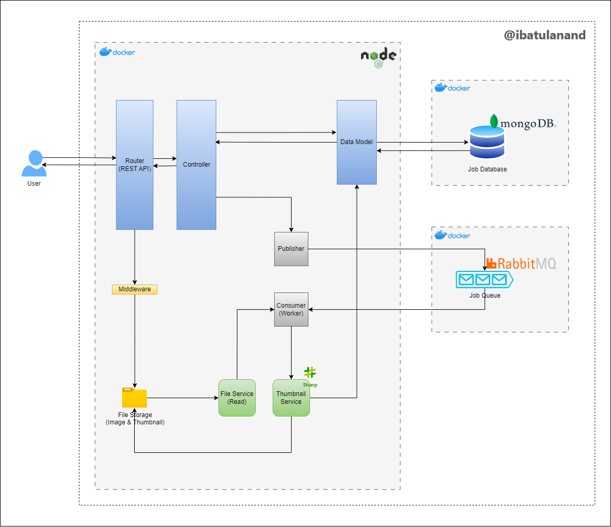

# EmojiThumb: Emoji Thumbnail API


A long-running job API for generating thumbnails of Emojis - primarily using NodeJs, MongoDB, and RabbitMQ.

Author: [Atul Anand](https://www.linkedin.com/in/ibatulanand/)

## Solution Overview

"EmojiThumb" is a long-running job API that accepts image files, generates thumbnails, and allows users to fetch the thumbnails once the processing is complete.
The API provides a seamless and efficient way to generate custom emojis, enhancing the communication experience of users.

To achieve a long-running job API, this project uses a queue-based worker architecture. When a user submits an image, the API will enqueue a job request containing the image details. Worker will then process the jobs asynchronously and generate thumbnail. The job status will be stored in a database for easy retrieval. Once a job is completed, the thumbnail can be fetched using the API.

### Solution Architecture



1. API Server: A NodeJS and ExpressJS based server that exposes endpoints for submitting images, checking job status, fetching thumbnails, listing all submitted jobs, and deleting job from the database.
   1. Producer: A producer of job in the queue based on request from the user.
   2. Consumer (Worker): A worker that listens to the job queue, processes the jobs, and generates thumbnails.
   3. Thumbnail Service: A Service for generating thumbnail using Sharp Image Processing Library.
   4. File Service: A Service for reading uploaded file as buffer for processing.
2. Message Queue: A RabbitMQ message queue to store incoming job requests.
3. Database: A MongoDB database to store job statuses and related information.
4. Storage: A location in local file system (/public directory, in this case) to save the original images and generated thumbnails.

### Tech Stack Used
<div>
    <table>
        <tr>
            <td>
                <strong>Languages</strong>
            </td>
            <td>
                <a href="https://www.javascript.com/en/">
                    
                </a>
                &emsp;
            </td>
        </tr>
        <tr>
            <td>
                <strong>Backend</strong>
            </td>
            <td>
                <a href="https://nodejs.org/" target="_blank">
                    
                </a> 
                &emsp;
                <a href="https://express.io/" target="_blank"> 
                    
                </a>
                &emsp;
            </td>
        </tr>
        <tr>
            <td>
                <strong>Libraries/Packages</strong>
            </td>
            <td>
                <a href="https://sharp.pixelplumbing.com/">
                    
                </a>
                &emsp;
                <a href="https://www.npmjs.com/package//winston" target="_blank"> 
                    
                </a>
                &emsp;
            </td>
        </tr>
        <tr>
            <td>
                <strong>Database</strong>
            </td>
            <td>
                <a href="https://mongodb.io/" target="_blank"> 
                    
                </a>
                &emsp;
            </td>
        </tr>
        <tr>
            <td>
                <strong>Message Broker (Queue)</strong>
            </td>
            <td>
                <a href="https://www.rabbitmq.com/" target="_blank"> 
                    
                </a>
                &emsp;
            </td>
        </tr>
        <tr>
            <td>
                <strong>Testing Framework</strong>
            </td>
            <td>
                <a href="https://jestjs.io/" target="_blank"> 
                    
                </a>
                &emsp;
            </td>
        </tr>
        <tr>
            <td>
                <strong>Others</strong>
            </td>
            <td>
                <a href="https://www.docker.com/" target="_blank"> 
                    
                </a>
                &emsp;
            </td>
        </tr>
    </table>
</div>
</br>


## Getting Started

### Prerequisites

- Docker and Docker Compose should be installed.
- Docker should be running.

### Setup & Deployment

1. Navigate to the project directory:
   ```
   cd thumbnail-api
   ```

2. Setup Environment Variable:
   
   Run the following command to create a `.env` file in directory `/thumbnail-api/src/config` and define the environment variables (if not already present):
    ```
    echo "PORT=3000
    MONGODB_URI=mongodb://mongodb:27017
    DB_NAME=job-app
    COLLECTION_NAME=jobs

    RABBITMQ_URI=amqp://rabbitmq:5672
    QUEUE_NAME=jobs
    IS_WORKER_RUNNING=false" > ./src/config/.env
    ```

3. Build and start the containers:
   ```
   docker compose up --build -d
   ```

4. Confirm that the containers are up-and-running:
   ```
   docker ps -a
   ```

&nbsp;

## Usage

### Interacting with application

The system should now be up and running. You can access the API endpoints and interact with the system using tools like Postman or cURL.

NOTE: A sample image (emoji :D) is located at `thumbnail-api/images/image.jpg` for testing the application usage.

- API endpoints:
  - Endpoint 1: CreateJob
    - Description: Endpoint to create a thumbnail generation job, by uploading an image
    - Method: `POST`
    - Path: `/api/upload`
    - cURL:
      - Request:
        ```
        curl --location '127.0.0.1:3000/api/upload' \
        --form 'image=@"</path/to/image.jpg>"'
        ```

        e.g.
        ```
        curl --location '127.0.0.1:3000/api/upload' \
        --form 'image=@"./images/image.jpg"'
        ```

      - Response:
        ```
        {
          "jobId":"646cc03067cd6aff9f9b1539"
        }
        ```
    - Postman:
      - 


  - Endpoint 2: GetJobById
    - Description: Endpoint to get the status of a thumbnail job for a job id
    - Method: `GET`
    - Path: `/api/job/:id/`
    - cURL:
      - Request:
        ```
        curl --location '127.0.0.1:3000/api/job/<jobId>'
        ```

        e.g.
        ```
        curl --location '127.0.0.1:3000/api/job/646cc03067cd6aff9f9b1539'
        ```
      - Response:
        ```
        {
          "status":"succeeded"
        }
        ```
    - Postman:
      - 


  - Endpoint 3: GetThumbnail
    - Description: Endpoint to get the thumbnail for a job id
    - Method: `GET`
    - Path: `/api/job/:id/thumbnail`
    - cURL:
      - Request:
        ```
        curl --location '127.0.0.1:3000/api/job/<jobId>/thumbnail' \
        --output '</path/to/thumbnail-output.jpg>'
        ```

        e.g.
        ```
        curl --location '127.0.0.1:3000/api/job/646cc03067cd6aff9f9b1539/thumbnail' \
        --output './images/thumbnail-output.jpg'
        ```

      - Response:
        ```
          (Downloads the output thumbnail image at location '/path/to/thumbnail-output.jpg')
          % Total    % Received % Xferd  Average Speed   Time    Time     Time  Current
                                   Dload  Upload   Total   Spent    Left  Speed
          100  2382  100  2382    0     0  33229      0 --:--:-- --:--:-- --:--:-- 34028
        ```
    - Postman:
      - 


  - Endpoint 4: ListJobs
    - Description: Endpoint to list jobs 
    - Method: `GET`
    - Path: `/api/jobs`
    - cURL:
      - Request:
        ```
        curl --location '127.0.0.1:3000/api/jobs'
        ```
      - Response:
        ```
        {
          "jobs": [
            {
              "_id": "646cc03067cd6aff9f9b1539",
              "imageFilename": "0f6590f2-3a36-459b-8704-6be696edff1c-image.jpg",
              "status": "succeeded",
              "createdAt": "2023-05-23T13:31:28.000Z"
            }
          ]
        }
        ```      
    - Postman:
      - 


  - Endpoint 5: DeleteJobById
    - Description: Endpoint to delete job by id 
    - Method: `DELETE`
    - Path: `/api/job/:id`
    - cURL:
      - Request:
        ```
        curl --location --request DELETE '127.0.0.1:3000/api/job/<jobId>'
        ```

        e.g.
        ```
        curl --location --request DELETE '127.0.0.1:3000/api/job/646cc03067cd6aff9f9b1539'
        ```
      - Response:
        ```
        {
          "message":"Job deleted successfully"
        }
        ```      
    - Postman:
      - 

- Viewing Logs:
  - For viewing the logs being generated by the container, run the following command:
    ```
    docker logs -f <node_app_container_name>
    ```

    e.g.
    ```
    docker logs -f thumbnail-api-app-1
    ```

&nbsp;    

### Running Tests

To run the tests of the project, follow these steps:

1. Ensure that the Docker containers are running using the following command:
   ```
   docker ps -a
   ```

   - If not, then start the containers with the following command:
      ```
      docker compose up --build -d
      ```

2. Access the running container and run the test inside the container, by executing the following command:
   ```
   docker exec -it <node_app_container_name> npm test
   ```
   e.g.
   ```
   docker exec -it thumbnail-api-app-1 npm test
   ```

&nbsp;


### Environment Cleanup 

- To completely stop and remove the containers and other resources (volume, network, etc.), run the following command:
  ```
  docker compose down -v
  ```

&nbsp;

## Other Information

### Trade-offs

During the development of the project, the following trade-offs were made:

1. Allowed File Formats: Currently the project only supports images uploaded in the ".jpg" format.
2. Thumbnail Sizing: The size of the thumbnail to be generated is fixed for now. This can be changed to be passed as input from the user to generate thumbnails of different sizes. 
3. Basic Authentication: The project currently does not include an authentication mechanism for API endpoints. Implementing a secure authentication system, such as JWT-based authentication, could enhance the security of the application.
4. Simplified Error Handling: Error handling has been implemented to handle common scenarios, but it may not cover all edge cases. Comprehensive error handling and error recovery mechanisms could be added to make the system more robust.

&nbsp;


### Future Implementation Scope

The future implementation scope includes:

1. User Authentication and Authorization: Implement user authentication and authorization mechanisms to secure API endpoints and restrict access to certain functionalities based on user roles and permissions.
2. User Management: Extend the system to include user management features such as user registration, profile management, and password reset functionality.
3. Image Processing Enhancements: Explore additional image processing capabilities such as resizing, cropping, filtering, or adding watermarks to provide a more comprehensive image manipulation service.
4. Advanced Queue Management: Enhance the message queue system by utilizing features like message priorities, delayed messages, or dead-letter queues for better control and management of job processing.
5. Search Functionality: Integrate search functionality to allow users to search for specific images or filter images based on tags, metadata, or other criteria.
6. Notification System: Implement a notification system to send notifications to users when certain events occur, such as successful image uploads, image processing completion, or system maintenance updates.

&nbsp;


### Deployment & Management in Production

For deploying and managing the containerized application in production, the following steps can be followed:

1. Set up a production environment with necessary infrastructure components such as load balancers, monitoring tools, and database clusters.
2. Build production-ready Docker images for the application.
3. Deploy the containers using container orchestration tools like Kubernetes.
4. Configure scaling policies based on traffic patterns and resource utilization to handle varying workloads.
5. Implement logging and monitoring solutions to capture metrics, logs, and traces for better observability.
6. Set up continuous integration and deployment (CI/CD) pipelines for seamless deployment and updates.
7. Regularly monitor the application's performance, conduct load testing, and perform necessary optimizations to ensure optimal performance and scalability.

&nbsp;


## Security
See [CONTRIBUTING](CONTRIBUTING.md) for more information. 

## License
This library is licensed under the MIT-0 License. See the [LICENSE](LICENSE) file.