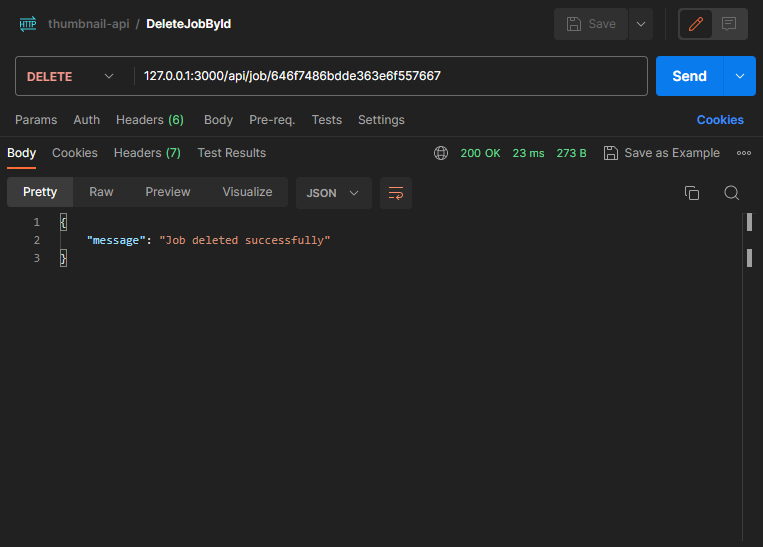

# EmojiThumb: Emoji Thumbnail API


A long-running job API for generating thumbnails of Emojis.

Author: [Atul Anand](https://www.linkedin.com/in/ibatulanand/)

## Table of Contents

- [EmojiThumb: Emoji Thumbnail API](#emojithumb-emoji-thumbnail-api)
  - [Table of Contents](#table-of-contents)
  - [Introduction](#introduction)
  - [Getting Started](#getting-started)
    - [Prerequisites](#prerequisites)
    - [Installation and Setup](#installation-and-setup)
  - [Usage](#usage)
  - [Running Tests](#running-tests)
  - [Architecture](#architecture)
    - [Solution Structure](#solution-structure)
    - [Technologies used to implement the solution:](#technologies-used-to-implement-the-solution)
    - [Libraries/Packages used in the project:](#librariespackages-used-in-the-project)
  - [Trade-offs and Future Improvements](#trade-offs-and-future-improvements)
  - [Future Implementation Scope](#future-implementation-scope)
  - [Deployment \& Management in Production](#deployment--management-in-production)


&nbsp;

## Introduction

The engineers at Cogent Labs like to create custom emojis for their communication apps, which requires them to create many small thumbnail images. "EmojiThumb" is a long-running job API that accepts image files, generates thumbnails, and allows users to fetch the thumbnails once the processing is complete.

With "EmojiThumb," engineers can easily upload their image files and receive optimized thumbnails tailored for their communication apps. The API provides a seamless and efficient way to generate custom emojis, enhancing the communication experience of users.

&nbsp;

## Getting Started

### Prerequisites

- Docker and Docker Compose should be installed.
- Docker should be running.

### Installation and Setup

1. Navigate to the project directory:
   ```
   cd thumbnail-api
   ```

2. Setup Environment Variable:
   
   Run the following command to create a `.env` file in directory `/thumbnail-api/src/config` and define the environment variables (if not already present):
    ```
    echo "PORT=3000
    MONGODB_URI=mongodb://mongodb:27017
    DB_NAME=job-app
    COLLECTION_NAME=jobs

    RABBITMQ_URI=amqp://rabbitmq:5672
    QUEUE_NAME=jobs
    IS_WORKER_RUNNING=false" > ./src/config/.env
    ```

3. Build and start the containers:
   ```
   docker compose up --build -d
   ```

&nbsp;

## Usage

The system should now be up and running. You can access the API endpoints and interact with the system using tools like Postman or cURL.

- API endpoints:
  - Endpoint 1: CreateJob
    - Description: Endpoint to create a thumbnail generation job, by uploading an image
    - Method: `POST`
    - Path: `/api/upload`
    - cURL:
      - Request:
        ```
        curl --location '127.0.0.1:3000/api/upload' \
        --form 'image=@"path/to/image.jpg"'
        ```
      - Response:
        ```
        {
          "jobId":"646cc03067cd6aff9f9b1539"
        }
        ```
    - Postman:
      - 


  - Endpoint 2: GetJobById
    - Description: Endpoint to get the status of a thumbnail job for a job id
    - Method: `GET`
    - Path: `/api/job/:id/`
    - cURL:
      - Request:
        ```
        curl --location '127.0.0.1:3000/api/job/646cc03067cd6aff9f9b1539'
        ```
      - Response:
        ```
        {
          "status":"succeeded"
        }
        ```
    - Postman:
      - 


  - Endpoint 3: GetThumbnail
    - Description: Endpoint to get the thumbnail for a job id
    - Method: `GET`
    - Path: `/api/job/:id/thumbnail`
    - cURL:
      - Request:
        ```
        curl --location '127.0.0.1:3000/api/job/646cc03067cd6aff9f9b1539/thumbnail' \
        --output '/path/to/thumbnail-output.jpg'
        ```
      - Response:
        ```
          (Downloads the output thumbnail image at location '/path/to/thumbnail-output.jpg')
          % Total    % Received % Xferd  Average Speed   Time    Time     Time  Current
                                   Dload  Upload   Total   Spent    Left  Speed
          100  2382  100  2382    0     0  33229      0 --:--:-- --:--:-- --:--:-- 34028
        ```
    - Postman:
      - 


  - Endpoint 4: ListJobs
    - Description: Endpoint to list jobs 
    - Method: `GET`
    - Path: `/api/jobs`
    - cURL:
      - Request:
        ```
        curl --location '127.0.0.1:3000/api/jobs'
        ```
      - Response:
        ```
        {
          "jobs": [
            {
              "_id": "646cc03067cd6aff9f9b1539",
              "imageFilename": "0f6590f2-3a36-459b-8704-6be696edff1c-image.jpg",
              "status": "succeeded",
              "createdAt": "2023-05-23T13:31:28.000Z"
            }
          ]
        }
        ```      
    - Postman:
      - 


  - Endpoint 5: DeleteJobById
    - Description: Endpoint to delete job by id 
    - Method: `DELETE`
    - Path: `/api/job/:id`
    - cURL:
      - Request:
        ```
        curl --location --request DELETE '127.0.0.1:3000/api/job/646cc03067cd6aff9f9b1539'
        ```
      - Response:
        ```
        {
          "message":"Job deleted successfully"
        }
        ```      
    - Postman:
      - 

- Viewing Logs:
  - For viewing the logs being generated by the container, run the following command:
    ```
    docker logs -f <node_app_container_name>
    ```

    e.g.
    ```
    docker logs -f thumbnail-api-app-1
    ```

&nbsp;    

## Running Tests

To run the tests of the project, follow these steps:

1. Ensure that the Docker containers are running using the following command:
   ```
   docker ps -a
   ```

   If not, then start the containers with the following command:
   ```
   docker compose up --build -d
   ```

2. Access the running container and run the test inside the container, by executing the following command:
   ```
   docker exec -it <node_app_container_name> npm test
   ```
   e.g.
   ```
   docker exec -it thumbnail-api-app-1 npm test
   ```

&nbsp;


## Architecture

To achieve a long-running job API, this project uses a queue-based worker architecture. When a user submits an image, the API will enqueue a job request containing the image details. Worker will then process the jobs asynchronously and generate thumbnail. The job status will be stored in a database for easy retrieval. Once a job is completed, the thumbnail can be fetched using the API.

### Solution Structure
1. API Server: An Express.js server that exposes endpoints for submitting images, checking job status, fetching thumbnails, listing all submitted jobs, and deleting job from the database.
2. Job Queue: A RabbitMQ message queue to store incoming job requests.
3. Worker: A separate process that listens to the job queue, processes the jobs, and generates thumbnails.
4. Database: A MongoDB database to store job statuses and related information.
5. Storage: A location in local file system (/public directory, in this case) to save the original images and generated thumbnails.

### Technologies used to implement the solution:
- Language: JavaScript
- Framework: Node.js, Express.js
- Message Broker (Queueing System): RabbitMQ
- Database: MongoDB
- Testing Framework: Jest
- Thumbnail Processing: Sharp

### Libraries/Packages used in the project:
- express: Web framework for Node.js, used to create REST APIs.
- mongodb: MongoDB driver, used to connect and store job related information into MongoDB database. 
- amqplib: Node.js client for RabbitMQ, used as a message broker (queue) to process thumbnails asynchronously. 
- multer: Middleware, used for handling image file uploads.
- sharp: Image processing library, used to generate thumbnails.
- uuid: Library, for generating unique identifiers (UUIDs) to attach to the original filename.
- dotenv: Module, used to load environment variables from a .env file into process.env.
- winston: Logging library, used for server logging.
- winston-daily-rotate-file: Transport, to rotate logs files daily and keep a maximum of 7 days.
- jest: JavaScript testing framework, used to write unit tests.
- supertest: Testing library, used to test API endpoints.

&nbsp;


## Trade-offs and Future Improvements

During the development of the project, the following trade-offs were made:

1. Allowed File Formats: Currently the project only supports images uploaded in the ".jpg" format.
2. Simplified Error Handling: Error handling has been implemented to handle common scenarios, but it may not cover all edge cases. Comprehensive error handling and error recovery mechanisms could be added to make the system more robust.
3. Basic Authentication: The project currently does not include an authentication mechanism for API endpoints. Implementing a secure authentication system, such as JWT-based authentication, could enhance the security of the application.
4. Limited Error Logging: While the project logs basic error messages using Winston, a more sophisticated logging system could be implemented to capture detailed logs, including request/response data and error traces, to facilitate debugging and monitoring.
5. Limited Validation: The input data validation in this project is kept minimal to demonstrate the core functionality. Depending on the specific use cases and requirements, additional validation checks and data sanitization could be added to enhance the overall robustness of the system.
6. Single Node Deployment: The current deployment of the system assumes a single node setup, where all components (API server, message broker, and database) are running on a single machine. This may limit scalability and fault tolerance. To achieve higher availability and scalability, the system can be redesigned to support distributed deployment with load balancing, replication, and sharding techniques.


Future improvements for the project include:

1. Enhanced Testing: Expanding the test suite to cover more scenarios, including edge cases and negative testing, to ensure comprehensive test coverage and improve the reliability of the application.
2. Scalability and Load Balancing: To handle a high load of requests, the application could be scaled horizontally by deploying multiple instances and utilizing a load balancer to distribute incoming traffic across these instances. This would help improve performance and ensure high availability.
3. Caching: Implementing a caching layer, such as Redis, to improve the performance of frequently accessed data and reduce the load on the database, resulting in faster response times and better scalability.
4. Monitoring and Logging: Implementing a robust monitoring and logging solution would allow for better visibility into the application's performance, resource usage, and error tracking. Tools like Prometheus, Grafana, or ELK (Elasticsearch, Logstash, Kibana) stack can be used to gather metrics and logs for analysis.
5. Security Enhancements: Strengthen security measures by implementing additional authentication and authorization mechanisms, securing sensitive data using encryption techniques, and conducting regular security audits to identify and address potential vulnerabilities.
6. Container Orchestration: Considering deploying the application using container orchestration platforms like Kubernetes to enable better scalability, fault tolerance, and easier management of the application in a production environment.
7. Continuous Integration and Deployment (CI/CD): Implement a CI/CD pipeline to automate the build, testing, and deployment processes. This would enable faster iterations, better code quality control, and easier release management.

&nbsp;


## Future Implementation Scope

The future implementation scope includes:

1. User Authentication and Authorization: Implement user authentication and authorization mechanisms to secure API endpoints and restrict access to certain functionalities based on user roles and permissions.
2. User Management: Extend the system to include user management features such as user registration, profile management, and password reset functionality.
3. Image Processing Enhancements: Explore additional image processing capabilities such as resizing, cropping, filtering, or adding watermarks to provide a more comprehensive image manipulation service.
4. Advanced Queue Management: Enhance the message queue system by utilizing features like message priorities, delayed messages, or dead-letter queues for better control and management of job processing.
5. Search Functionality: Integrate search functionality to allow users to search for specific images or filter images based on tags, metadata, or other criteria.
6. Notification System: Implement a notification system to send notifications to users when certain events occur, such as successful image uploads, image processing completion, or system maintenance updates.
7. Rate Limiting: Introduce rate limiting mechanisms to protect the API endpoints from abuse or excessive requests. This can help prevent potential Denial of Service (DoS) attacks and ensure fair usage of system resources.
8. Data Replication and Backup: Set up data replication and backup strategies to ensure data durability and disaster recovery. This could involve implementing database replication, periodic backups, and off-site storage of backups to protect against data loss.
9. Container Orchestration and Deployment: Utilize container orchestration platforms like Kubernetes to deploy and manage the application in a distributed environment, providing scalability, fault tolerance, and easy scaling options.
10. Integration with External Services: Integrate with third-party services such as cloud storage providers, CDN (Content Delivery Network) services, or image recognition APIs to enhance the application's capabilities and provide additional value to users.

&nbsp;


## Deployment & Management in Production

For deploying and managing the containerized application in production, the following steps can be followed:

1. Set up a production environment with necessary infrastructure components such as load balancers, monitoring tools, and database clusters.
2. Build production-ready Docker images for the application.
3. Deploy the containers using container orchestration tools like Kubernetes.
4. Configure scaling policies based on traffic patterns and resource utilization to handle varying workloads.
5. Implement logging and monitoring solutions to capture metrics, logs, and traces for better observability.
6. Set up continuous integration and deployment (CI/CD) pipelines for seamless deployment and updates.
7. Regularly monitor the application's performance, conduct load testing, and perform necessary optimizations to ensure optimal performance and scalability.

&nbsp;
